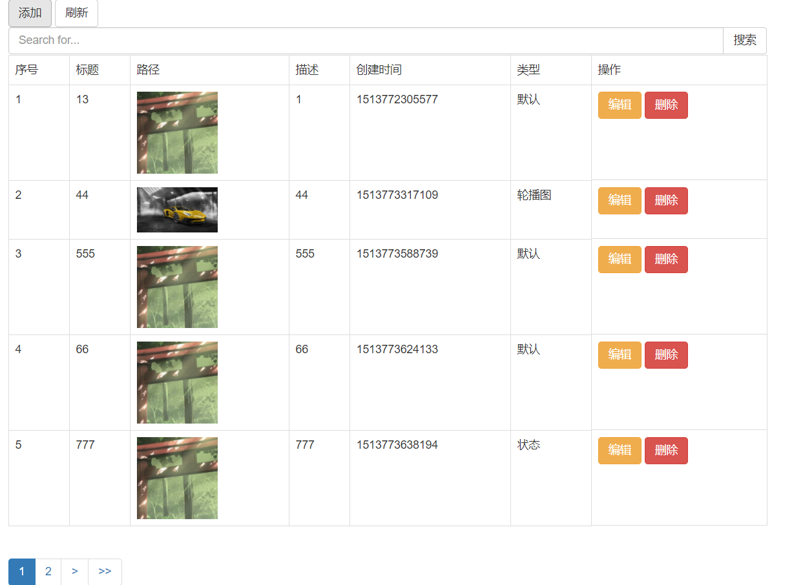
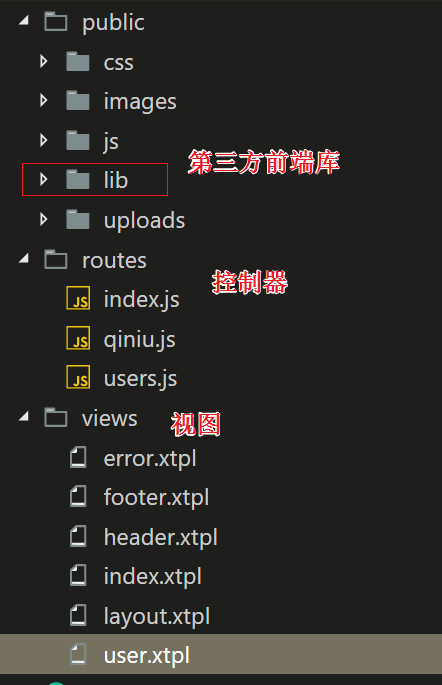

# nodejs crud功能

## 功能

一个页面数据的crud 具有分页 模糊查询 图片上传七牛 前端预览 

## 前端 ajax+formData+html5-require原生验证+FileReader前端图片预览+bootstrap+bootstrap-bootstrap paginator+art-template

### 文件存储 前端直传七牛云(原生formdata直传)

## 后台 nodejs+express+xtemplate+mysql+orm2

前言,就是想要做一个crud的demo,把上面的技术都走一走(主要是要走通nodejs+express+orm+xtemplate+FormData+ajax+FileReader)

## 界面



## 安装

### 构建数据库


#### sql 代码

```mysql
/*
Navicat MySQL Data Transfer

Source Server         : localhost_3306
Source Server Version : 50617
Source Host           : localhost:3306
Source Database       : cso2017

Target Server Type    : MYSQL
Target Server Version : 50617
File Encoding         : 65001

Date: 2017-12-22 10:31:12
*/

SET FOREIGN_KEY_CHECKS=0;

-- ----------------------------
-- Table structure for `media`
-- ----------------------------
DROP TABLE IF EXISTS `media`;
CREATE TABLE `media` (
  `id` tinyint(4) NOT NULL AUTO_INCREMENT,
  `title` varchar(50) DEFAULT '',
  `src` text,
  `des` text,
  `createTime` varchar(50) DEFAULT '',
  `type` int(11) DEFAULT '-1' COMMENT '媒体类型\r\n-1 默认\r\n0 轮播图\r\n1 优秀标兵\r\n2 状态\r\n3 动态',
  `isDelete` tinyint(1) unsigned zerofill DEFAULT '0' COMMENT '0 false 1 true',
  PRIMARY KEY (`id`)
) ENGINE=InnoDB AUTO_INCREMENT=25 DEFAULT CHARSET=latin1;

-- ----------------------------
-- Records of media
-- ----------------------------
INSERT INTO `media` VALUES ('1', '1', 'uploads/151375821335921420-106.jpg', '2', '1513758213360', '-1', '1');
INSERT INTO `media` VALUES ('2', '22', 'p1935eslc.bkt.clouddn.com1513772101394222.png', '22', '1513772102349', '1', '1');
INSERT INTO `media` VALUES ('3', '33', 'http://p1935eslc.bkt.clouddn.com/1513772179071222.png', '33', '1513772181066', '-1', '1');
INSERT INTO `media` VALUES ('4', '11', 'http://p1935eslc.bkt.clouddn.com/1513772206802222.png', '11', '1513772209600', '0', '1');
INSERT INTO `media` VALUES ('5', '11', '', '11', '1513772267496', '-1', '1');
INSERT INTO `media` VALUES ('6', '13', 'http://p1935eslc.bkt.clouddn.com/1513773929540222.png', '1', '1513772305577', '-1', '0');
INSERT INTO `media` VALUES ('7', '33', '', '33', '1513773221744', '-1', '1');
INSERT INTO `media` VALUES ('8', '44', '', '44', '1513773292398', '1', '1');
INSERT INTO `media` VALUES ('9', '44', 'http://p1935eslc.bkt.clouddn.com/1513773307440340372-106.jpg', '44', '1513773317109', '0', '0');
INSERT INTO `media` VALUES ('10', '55', 'http://p1935eslc.bkt.clouddn.com/1513773371196350902-106.jpg', '55', '1513773398180', '-1', '1');
INSERT INTO `media` VALUES ('11', '55', 'http://p1935eslc.bkt.clouddn.com/1513773517413222.png', '55', '1513773520467', '-1', '1');
INSERT INTO `media` VALUES ('12', '555', 'http://p1935eslc.bkt.clouddn.com/1513773586654222.png', '555', '1513773588739', '-1', '0');
INSERT INTO `media` VALUES ('13', '66', 'http://p1935eslc.bkt.clouddn.com/1513773621490222.png', '66', '1513773624133', '-1', '0');
INSERT INTO `media` VALUES ('14', '777', 'http://p1935eslc.bkt.clouddn.com/1513773632543222.png', '777', '1513773638194', '2', '0');
INSERT INTO `media` VALUES ('15', '8', 'http://p1935eslc.bkt.clouddn.com/151377400387837094-106.jpg', '8', '1513773982037', '-1', '0');
INSERT INTO `media` VALUES ('16', '9', '', '9', '1513907210481', '-1', '1');
INSERT INTO `media` VALUES ('17', '11', '', '11', '1513907333323', '-1', '1');
INSERT INTO `media` VALUES ('18', '12', '', '12', '1513907424628', '1', '1');
INSERT INTO `media` VALUES ('19', '33', '', '33', '1513907485859', '-1', '1');
INSERT INTO `media` VALUES ('20', '44', '', '44', '1513907597748', '-1', '1');
INSERT INTO `media` VALUES ('21', '55', '', '555', '1513907798788', '-1', '1');
INSERT INTO `media` VALUES ('22', '66', 'http://p1935eslc.bkt.clouddn.com/151390780567141077-106.jpg', '66', '1513907807289', '-1', '0');
INSERT INTO `media` VALUES ('23', '444', 'http://p1935eslc.bkt.clouddn.com/1513907892102337602-106.jpg', '444', '1513907895662', '1', '0');
INSERT INTO `media` VALUES ('24', '111', 'http://p1935eslc.bkt.clouddn.com/1513908485005337030-106.jpg', '1111', '1513908495119', '-1', '0');
/*
Navicat MySQL Data Transfer

Source Server         : localhost_3306
Source Server Version : 50617
Source Host           : localhost:3306
Source Database       : cso2017

Target Server Type    : MYSQL
Target Server Version : 50617
File Encoding         : 65001

Date: 2017-12-19 22:39:54
*/

SET FOREIGN_KEY_CHECKS=0;

-- ----------------------------
-- Table structure for `media`
-- ----------------------------
DROP TABLE IF EXISTS `media`;
CREATE TABLE `media` (
  `id` tinyint(4) NOT NULL AUTO_INCREMENT,
  `title` varchar(50) DEFAULT '',
  `src` text,
  `des` text,
  `createTime` varchar(50) DEFAULT '',
  `type` int(11) DEFAULT '-1' COMMENT '媒体类型\r\n-1 默认\r\n0 轮播图\r\n1 优秀标兵\r\n2 状态\r\n3 动态',
  `isDelete` tinyint(1) unsigned zerofill DEFAULT '0' COMMENT '0 false 1 true',
  PRIMARY KEY (`id`)
) ENGINE=InnoDB AUTO_INCREMENT=15 DEFAULT CHARSET=latin1;

-- ----------------------------
-- Records of media
-- ----------------------------
INSERT INTO `media` VALUES ('1', '11', '1111', '111111', '11111111', '-1', '1');
INSERT INTO `media` VALUES ('2', '2', '22', '222', '22222', '-1', '1');
INSERT INTO `media` VALUES ('3', '1', 'uploads/37094-106.jpg', '3333', '1513678617873', '0', '0');
INSERT INTO `media` VALUES ('4', '2', 'uploads/295727-106.jpg', '333', '1513678633962', '1', '0');
INSERT INTO `media` VALUES ('5', '3', 'uploads/21420-106.jpg', '3333', '1513678676016', '-1', '0');
INSERT INTO `media` VALUES ('6', '4', 'uploads/37094-106.jpg', '111111', '1513678755337', '-1', '0');
INSERT INTO `media` VALUES ('7', '5', 'uploads/41077-106.jpg', '444', '1513678769503', '-1', '0');
INSERT INTO `media` VALUES ('8', '6', 'uploads/37094-106.jpg', '777', '1513679508958', '-1', '0');
INSERT INTO `media` VALUES ('9', '7', 'uploads/21420-106.jpg', '888', '1513679540648', '-1', '0');
INSERT INTO `media` VALUES ('10', '888', 'uploads/350947-106.jpg', '8888', '1513691658007', '2', '0');
INSERT INTO `media` VALUES ('11', '99', 'uploads/127678-106.jpg', '999', '1513691885585', '-1', '0');
INSERT INTO `media` VALUES ('12', '10', 'uploads/129643-106.jpg', '10', '1513691925412', '-1', '0');
INSERT INTO `media` VALUES ('13', '11', 'uploads/268223-106.jpg', '11', '1513691939124', '-1', '0');
INSERT INTO `media` VALUES ('14', '12', 'uploads/37094-106.jpg', '12', '1513692236017', '-1', '0');

```

### 安装nodejs后台环境

这里选择的搭配是nodejs+express 4.x + orm +xtemplate

[传送门express](http://www.expressjs.com.cn/)

通过如下命令安装：

```
npm install express-generator -g
```

例如，下面的示例就是在当前工作目录下创建一个命名为 *myapp* 的应用。

```
express myapp
```

然后安装所有依赖包：

```
cd myapp 
npm install
```

Windows 平台使用如下命令：

```
> set DEBUG=myapp & npm start
```

然后在浏览器中打开 `http://localhost:3000/` 网址就可以看到这个应用了。

还要安装其他依赖

orm mysql 对象关系模型框架

[传送门orm](https://www.npmjs.com/package/orm)

```
npm i orm --save
```

安装 xtemplate

```
npm i xtemplate --save
```

### 项目主要文件目录结构



### 后台app.js文件

```
// 引入orm模块
var orm = require('orm');
// 设置静态文件目录
app.use(express.static('public'));
// 修改视图引擎jade改为xtemplate- 不喜欢jade怪异的模样
app.set('view engine', 'xtpl');

// 修改上传文件的大小 默认上传太小了 超过1MB都会报错 所以提前修改  报错信息提示:payload 提示太大
app.use(bodyParser.json({limit:'50mb'}));
app.use(bodyParser.urlencoded({limit:'50mb',extended:true}));

// 定义数据模型 连接mysql 将模型绑定到 req对象上
app.use(orm.express("mysql://root@localhost/cso2017", {
  define: function (db, models, next) {
    var media= db.define("media", {
      // 字段都是和mysql中对应的
      id: { type: 'serial', key: true },
      title: { type: 'text' },
      src: { type: 'text' },
      des: { type: 'text' },
      createTime: { type: 'text' },
      type: { type: 'number' },
      isDelete: { type: 'number' }
    });
    models.media=media;
    next();
  }
}));

// 用来指定路由处理的
app.use('/', index);
app.use('/users', users);


```

### 后台 七牛 router/qiuniu.js  

[传送门七牛](https://portal.qiniu.com/signup/email)

```javascript
var express = require('express');
var qiniu = require('qiniu');
var router = express.Router();

// 我的七牛的accessKey-此处修改为自己的即可
var accessKey = 'xxxxxxx';
// 我的七牛的 secretKey - 此处修改为自己的即可
var secretKey = 'xxxxx';
var options = {
  // 空间名字 buket
  scope: "xxxx",
};
var putPolicy = new qiniu.rs.PutPolicy(options);
var mac = new qiniu.auth.digest.Mac(accessKey, secretKey);
// 上传凭证
var uploadToken = putPolicy.uploadToken(mac);

router.get("/token", function (req, res, next) {
  console.log(uploadToken);
  res.send({
    "uptoken": uploadToken
  });
})
module.exports = router;
```


### 后台  router/user.js

```javascript
var express = require('express');
var router = express.Router();
// 中间件 某则 req中获取不到上传参数(因为express 4.x 改变了 3.x获取参数的形式)
var multipart = require('connect-multiparty');
var multipartMiddleware = multipart();
var fs = require('fs');
var orm = require('orm');
router.get('/', function (req, res, next) {
  res.render('user', { title: '我来拉' });
});

// 获取分页数据
router.get("/getList", function (req, res, next) {
  // 获取分页数据
  var page = +req.query.page;
  var rows = +req.query.rows;
  var title = req.query.title;
  // 注意要传入的类型是数字
  // limit 限制一共取几条 rows
  // offset 往后偏移几条   下一页的条数
  // mysql查询参数
  var queryObj = { isDelete: "0", title: orm.like('%' + title + '%') };
  req.models.media.find(queryObj).all().limit(rows).offset((page - 1) * rows).run(function (error0, medias) {
    if (error0) res.send(error0);

    // 计算分页后的总数据
    req.models.media.count(queryObj, function (error1, count) {
      if (error1) res.send(error1);
      // medias.total = count;
      var obj = {
        data: medias,
        total: count,
        page: page,
        rows: rows
      };
      res.send(obj);
    });
  })
});

// 删除
router.get("/del", function (req, res, next) {
  var id = req.query.id;
  req.models.media.get(id, function (err, oldData) {
    if (err) throw err;
    oldData.isDelete = 1;
    oldData.save(function (err1) {
      if (err1) throw err1;
      res.send({ status: 0, msg: "删除成功" });
    })
  })
})

/* post 添加 */
router.post("/add", multipartMiddleware, function (req, res, next) {
  var file = req.files.src;
  var formBody = req.body;
  formBody.src = formBody.src;
  formBody.createTime = Date.now();
  formBody.isDelete = 0;
  req.models.media.create(formBody, function (err) {
    if (err) throw err;
    // 正常执行
    res.send({ status: 0, msg: "新增成功" });
  })

})

// 编辑
router.post("/edit", multipartMiddleware, function (req, res, next) {
  /* 
  1 有修改了图片文件的 重新保存和提交
  2 没有修改图片的 只修改字段即可

  3 改用七牛云 直接存储字段即可
   */
  var formBody = req.body;
  req.models.media.get(formBody.id, function (err, oldData) {
    oldData.title = formBody.title;
    oldData.des = formBody.des;
    oldData.type = formBody.type;
    oldData.src = formBody.src;
    // 保存数据 同步保存数据
    oldData.save(function (err) {
      if (err) throw err;
      res.send({ status: 0, msg: "编F辑成功" });
    });
  });

})
/**
 * 
 * @param {*要保存的文件} file 
 * @param {*文件保存的全路径} path  abc/
 * @param {*回调函数} callback 参数 imgPath 图片全路径
 */
function saveFile(file, path, callback) {
  fs.readFile(file.path, function (err, data) {
    if (err) {
      console.log(err);
    } else {
      // 存储文件
      var imgPath = "uploads/" + path + Date.now() + file.originalFilename;
      fs.writeFile("public/" + imgPath, data, function (err1) {
        if (err1) {
          console.log(err1);
        } else {
          // 存入数据库
          callback(imgPath);
        }
      });
    }
  });
}
module.exports = router;

```

### 前端 common.js

```
$(function () {

  // 往art-template中注册方法
  template.helper("toJson", function (str) {
    return JSON.stringify(str);
  });
  // 将数字转为 对应的多媒体类型
  template.helper("toType", function (num) {
    var str = "默认";
    switch (num) {
      case -1:
        break;
      case 0:
        str = "轮播图";
        break;
      case 1:
        str = "优秀标兵";
        break;
      case 2:
        str = "状态";
        break;
      case 3:
        str = "动态";
        break;
      default:
        break;
    }
    return str;
  })
})
```

### 前端 user.xtpl  xtpl 是xtemplate特定的文件形式

```html
<!DOCTYPE html>
<html lang="en">

<head>
  <meta charset="UTF-8">
  <meta name="viewport" content="width=device-width, initial-scale=1.0">
  <meta http-equiv="X-UA-Compatible" content="ie=edge">
  <title>Document</title>
  <!-- 注意 因为在app.js中设置了 app.use(express.static('public')); 所以路径忽略public文件夹,直接到子层即可 -->
  <link rel="stylesheet" href="lib/bootstrap/css/bootstrap.min.css">
  <link rel="stylesheet" href="css/user.css">
</head>

<body>
  <!-- 遮罩层 -->
  <div class="mask"></div>
  <div class="container">
    <div>
      <button class="btn btn-default" id="add">添加</button>
      <button class="btn btn-default" id="reflash">刷新</button>
      <div class="input-group">
        <input type="text" class="form-control searchInp" placeholder="Search for...">
        <span class="input-group-btn">
          <button class="btn btn-default searchBtn" type="button">搜索</button>
        </span>
      </div>
    </div>
    <div>
      <table class="table table-bordered"></table>
    </div>
    <div>
      <nav aria-label="Page navigation">
        <ul class="pagination"></ul>
      </nav>
    </div>
  </div>
  <!-- 模态框 -->
  <div id="myModal" class="modal fade" tabindex="-1" role="dialog">
    <div class="modal-dialog" role="document">
      <div class="modal-content">
        <div class="modal-header">
          <button type="button" class="close" data-dismiss="modal" aria-label="Close">
            <span aria-hidden="true">&times;</span>
          </button>
          <h4 class="modal-title">操作数据</h4>
        </div>
        <div class="modal-body">
          <form id="ff" class="form-horizontal" enctype="multipart/form-data">
            <input type="hidden" name="id">
            <div class="form-group">
              <label for="title" class="col-sm-2 control-label">请输入标题</label>
              <div class="col-sm-10">
                <input required type="text" class="form-control" name="title" id="title" placeholder="Email">
              </div>
            </div>
            <div class="form-group">
              <label for="fileInp" class="col-sm-2 control-label">上传文件</label>
              <div class="col-sm-10 " id="upParent">
                <input required type="file" class="form-control" id="fileInp" placeholder="Email">
                <input type="hidden" name="src" id="hiddenSrc">
              </div>
            </div>
            <div class="form-group">
              <div class="col-sm-10 col-sm-offset-2">
                <input type="image" width="100" src="images/default.png" name="srcImage" id="src">
              </div>
            </div>
            <div class="form-group">
              <label for="type" class="col-sm-2 control-label">类型</label>
              <div class="col-sm-10">
                <select name="type" class="form-control" id="type">
                  <option value="-1">默认</option>
                  <option value="0">轮播图</option>
                  <option value="1">优秀标兵</option>
                  <option value="2">状态</option>
                  <option value="3">动态</option>
                </select>
              </div>
            </div>
            <div class="form-group">
              <label for="inputEmail3" class="col-sm-2 control-label">描述</label>
              <div class="col-sm-10">
                <textarea placeholder="请输入详细描述" required name="des" id="des" class="form-control"></textarea>
              </div>
            </div>
          </form>
        </div>
        <div class="modal-footer">
          <button type="button" id="canBtn" class="btn btn-default" data-dismiss="modal">Close</button>
          <button type="submit" form="ff" id="subBtn" class="btn btn-primary">提交</button>
        </div>
      </div>
    </div>
  </div>

  <!-- 删除模态框 -->
  <div class="modal fade" id="deleteModal" tabindex="-1" role="dialog">
    <div class="modal-dialog" role="document">
      <div class="modal-content">
        <div class="modal-header">
          <button type="button" class="close" data-dismiss="modal" aria-label="Close">
            <span aria-hidden="true">&times;</span>
          </button>
          <h4 class="modal-title">警告</h4>
        </div>
        <div class="modal-body">
          你确定要删除吗
        </div>
        <div class="modal-footer">
          <button type="button" class="btn btn-default" data-dismiss="modal">取消</button>
          <button type="button" class="btn btn-danger delSubBtn ">删除</button>
        </div>
      </div>
      <!-- /.modal-content -->
    </div>
    <!-- /.modal-dialog -->
  </div>
  <!-- /.modal -->

  <!-- art-template 模板引擎语法 -->
  <script type="text/html" id="tblTpl">
    {{%
    <tr>
      <td>序号</td>
      <td>标题</td>
      <td>路径</td>
      <td>描述</td>
      <td>创建时间</td>
      <td>类型</td>
      <td>操作</td>
    </tr>
    {{each data as value i}}
    <tr data-value="{{toJson(value)}}" >
      <td>{{(page-1)*rows+ i+1 }}</td>
      <td>{{ value.title }}</td>
      <td></td>
        <td>{{  value.des }}</td>
        <td>{{  value.createTime }}</td>
        <td>{{  toType(value.type) }}</td>
        <td><button class="btn btn-warning dataEditBtn " data-id="{{value.id}}" >编辑</button> <button  data-id="{{value.id}}" class="btn btn-danger dataDelBtn" >删除</button> </td>
        </tr>
      {{/each}}
      %}}
  </script>
  <script src="lib/jquery.min.js"></script>
  <script src="lib/bootstrap/js/bootstrap.min.js"></script>
  <!-- 分页插件 -->
  <script src="lib/bootstrap-paginator.min.js"></script>
  <script src="lib/template.js"></script>
  <script src="js/common.js"></script>
  <script src="js/user.js"></script>
</body>
</html>
```

### 前端 user.css

```css
table img {
    width: 100%;
    max-width: 100px;
}

.mask {
    position: fixed;
    width: 100%;
    height: 100%;
    opacity: .5;
    background-color: #000;
    z-index: 100000;
}

.mask::after {
    display: block;
    content: "";
    position: absolute;
    width: 10px;
    height: 10px;
    border: 1px solid #fff;
    background-color: blue;
    border-radius: 50%;
    left: 50%;
    top: 50%;
    margin-left: -50px;
    margin-top: -50px;
    transform-origin: 45px 45px;
    animation: ani_loading .5s infinite linear;
}

@keyframes ani_loading {
    0% {}
    100% {
        transform: rotate(360deg);
    }
}
```

### 前端 user.js

```javascript

$(function () {
  // 查询参数
  var QueryPage = {
    page: 1,
    rows: 5,
    title: ""
  };
  // 操作类型
  // 0 新增 1 编辑 2 删除 默认为0 新增
  var ManagerType = 0;
  // 总页数
  var TotalPages = 1;
  // 要删除数据的id
  var DelID = -1;
  getList(setPage);
  function getList(callback) {
    QueryPage.title = $.trim($(".searchInp").val());
    $.get("users/getList", QueryPage, function (result) {
      // 计算总页数
      TotalPages = Math.ceil(result.total / QueryPage.rows);
      var html = template("tblTpl", result);
      $("table").html(html);
      callback && callback();
    })
  }
  function setPage(params) {
    // bs 分页插件设置
    var options = {
      bootstrapMajorVersion: 3,
      currentPage: QueryPage.page,//当前页面  
      numberOfPages: QueryPage.rows,//一页显示几个按钮（在ul里面生成5个li）  
      totalPages: TotalPages,//总页数  
      onPageClicked: function (event, originalEvent, type, page) {
        QueryPage.page = page;
        getList(setPage);
      }
    }
    $(".pagination").bootstrapPaginator(options);
  }


  // 搜索
  $(".searchBtn").click(function (params) {
    QueryPage.page = 1;
    getList(setPage);
    // 点击搜索后 设置分页插件自动回到第一页
    $(".pagination").bootstrapPaginator("showFirst");
  })

  // 选择图片后,在前端即时预览
  $("#fileInp").change(function (e) {
    // console.log(e);
    var file = e.target.files[0];
    var fr = new FileReader();
    fr.readAsDataURL(file);
    fr.onload = function () {
      $("#src").attr("src", fr.result);
    }
  })

  // 编辑
  $("table ").on("click", ".dataEditBtn", function (e) {
    /* 
    0 存入当前操作提示 编辑 ManagerType=1 
    1 弹出对话框
    2 填充表单
    3 去除 文件上传按钮 required属性
     */
    ManagerType = 1;
    $("#myModal").modal("show");

    // 获取被操作的行上的元数据 data-value
    //parentsUntil  查找当前元素的所有的父辈元素，直到遇到匹配的那个元素为止。 包含了下面所有找到的父辈元素，但不包括那个选择器匹配到的元素。 
    var obj = $(e.target).parents("tr").data("value");

    // 2 填充数据
    $("input[name='title']").val(obj.title);
    $("input[name='id']").val(obj.id);
    // $("input[name='src']").val(obj.src);
    $("[name='des']").val(obj.des);
    $("[name='type']").val(obj.type);
    // 图片按钮
    $("input[name='srcImage']").attr("src", obj.src);

    // 3 
    // $("input[type='src']").removeAttr("required");
    // 可能存在编辑文件时 没重新提交图片 所以去除验证
    $("#fileInp").removeAttr("required");
  })

  // 新增
  $("#add").click(function (e) {
    /* 
    1 操作类型
    2 弹出对话框
    3 清空表单
    4 添加文件上传按钮 required属性
     */
    ManagerType = 0;
    $("#myModal").modal("show");
    $("input[name='src']").attr("required", "");
    $("#ff")[0].reset();
    // 清除图片路径的隐藏于
    $("input[name='src']").val("");
    // 清除图片按钮
    $("input[type='image']").attr("src", "");
    $("input[type='image']").val("");
  })

  // 提交
  $("#ff").submit(function (e) {
    /* 
    1 发送了3个ajax a 请求上传图片的token b 上传到七牛 获取图片链接 c 将数据插入到后台
     */
    e.preventDefault();

    // formData.append("src", $("input[name='src']").val());
    // 判断操作类型 0 为新增  1 为编辑 2 为删除
    if (ManagerType == 0) {
      // 获取最新的token
      $.get("/qiniu/token", function (token) {
        var file = $("#fileInp")[0].files[0];
        // 构造formdata 上传到七牛使用
        var f = new FormData();
        f.append("key", Date.now() + file.name);
        f.append("token", token.uptoken);
        f.append("file", file);
        $.ajax({
          url: "http://upload.qiniup.com/",
          type: "POST",
          data: f,
          cache: false,
          // 不用jq处理
          processData: false,
          contentType: false,
          success: function (r) {
            // console.log(r);
            // 外链名字
            var namepace = "http://p1935eslc.bkt.clouddn.com/";
            // 图片的完整名字
            var imgPath = namepace + r.key;
            // 构造参数,添加到后台
            $("input[name='src']").val(imgPath);
            var formData = new FormData($("#ff")[0]);
            $.ajax({
              url: "/users/add",
              type: "POST",
              data: formData,
              cache: false,
              // 不用jq处理
              processData: false,
              contentType: false,
              success: function (result) {
                // console.log(e);
                // 关闭对话框 刷新数据列表
                $("#myModal").modal("hide");
                QueryPage = {
                  page: 1,
                  rows: 5
                };
                getList(setPage);
              },
              error: function (e) {
                // console.log(e);
              }
            });
          }
        });
      });
    } else if (ManagerType == 1) {
      // 编辑
      var formData = new FormData($("#ff")[0]);
      $.ajax({
        url: "/users/edit",
        type: "POST",
        data: formData,
        cache: false,
        // 不用jq处理
        processData: false,
        contentType: false,
        success: function (result) {
          // console.log(e);
          // 关闭对话框 刷新数据列表
          $("#myModal").modal("hide");
          QueryPage = {
            page: 1,
            rows: 5
          };
          getList(setPage);
        },
        error: function (e) {
          // console.log(e);
        }
      })
    }
  });

  // 删除
  $("table").on("click", ".dataDelBtn", function (e) {
    var id = $(e.target).parents("tr").data("value").id;
    DelID = id;
    $("#deleteModal").modal("show");
  });
  // 提交删除
  $(".delSubBtn").click(function (e) {
    /* 
    1 发送删除请求
    2 关闭对话框
    3 刷新数据
     */
    $.get("users/del?id=" + DelID, function (result) {
      $("#deleteModal").modal("hide");
      if (result.status == 0) {
        // 成功
        QueryPage.page = 1;
        getList(setPage);
      }
    })
  })
})

// 显示进度条
$(window).ajaxStart(function () {
  $(".mask").show();
})
// 隐藏进度条
$(window).ajaxStop(function () {
  $(".mask").hide();
})

```

## 注意

整个demo download下后,需要修改的地方有 

数据库连接代码 在app.js中

七牛的密钥等,在router/qiniu.js 中

环境: nodejs 8.3.0 express 4.x 其他 都是最新版本. 

如有错误,联系方式 不懂先生  yeah126139163@163.com  